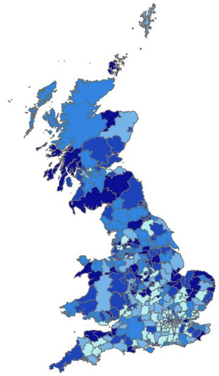
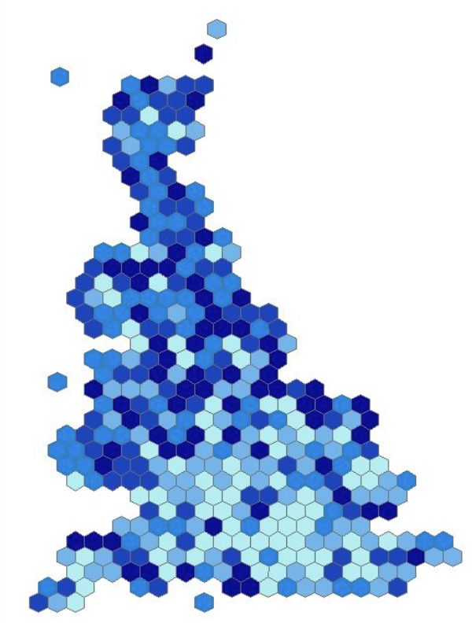
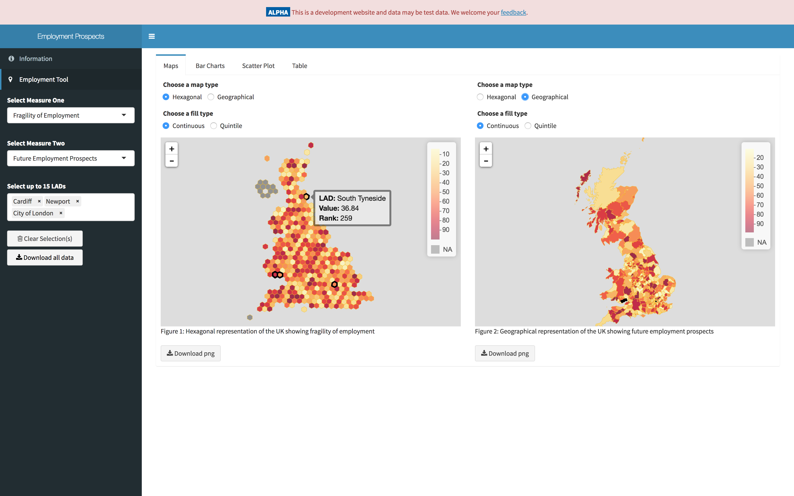
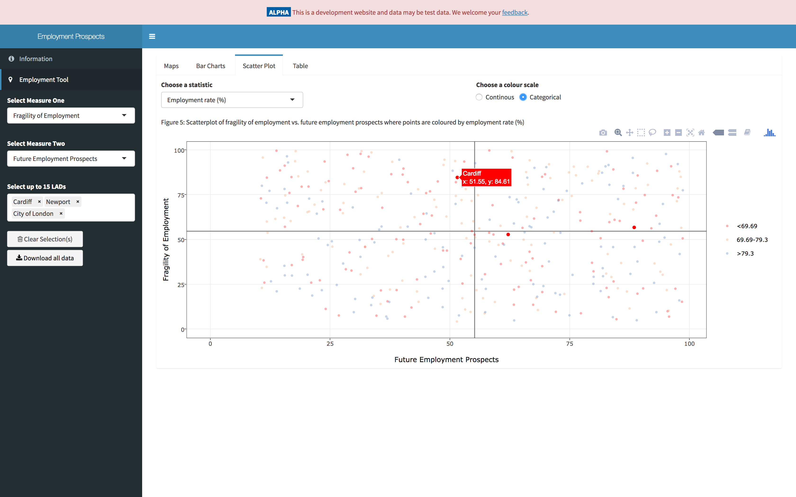

# Converting Static Statistical Reports Into Interactive Web Apps Using Shiny

## Introduction

In November 2016, ONS released an analysis piece with research which mapped labour market risk and vulnerability at a local authority level across Great Britain to aid policy makers in their decision making. It was based on two composite measures focusing on the resilience of current jobs, and the conditions for future jobs growth.

The research aimed to go beyond identifying local authorities which already exhibit clear signs of local labour market failure - and which are therefore known to policy officials already.

Instead, the research sought to identify local areas which, despite strong or average performance today, may be vulnerable to future employment decline. Amongst areas with weak performance today, it also tries to differentiate between those which have observable seeds of future growth and those which do not show signs of future resilience.

## The Problem

Just before Christmas 2016 the Campus was approached by the Cabinet Office to convert this analysis into an interactive one. The analysis contained many geographical images of the UK broken down by local authority, with each authority's area being shaded by their statistical value. These maps presented the following issues:

1. It is difficult to identify a local authority if it is small relative to other regions.
2. It is difficult to compare local authorities.

The data were also presented using a hexagonal representation of the UK, where each hexagon represented a local authority. These maps presented similar issues:

1. The hexagons are not necessarily in their "true" position
2. It is difficult to compare local authorities.

 
Figure 1: Examples of the geographical and hexagonal maps of the UK included in the original analysis.

In addition, as the original analysis was presented in a pdf document, disseminating it was laborious as email was typically used. Finally, we had to do all of this work within a tight four week deadline.

## Objectives

The challenge we were presented with then was simple. We needed to take the analysis that ONS had already produced and turn it into an interactive web app. This also allowed us to fill a few additional requirements that were not available to a static document. For example, we were challenged to present the data in a tabular format, add interactive bar charts, add markers to the map and the ability to search for multiple local authorities.

## What We Did

We decided to build a prototype for what the application could be using [Shiny](http://shiny.rstudio.com/). We chose Shiny as it allows us to utilise the power of [R](https://cran.r-project.org/) along with powerful JavaScript libraries such as [leaflet](http://leafletjs.com/). Working in an agile way, we were able to implement enhancements and features iteratively, working on the most important features initially before concentrating on the UI in the latter stages of the project. A screenshot of the application can be seen in Figure 2.

 
Figure 2: The interactive maps (note the data shown here are dummy data).

As can be seen from Figure 2, policy makers are able to select and compare two different measures side by side in either a hexagonal or geographical representation of the UK which is fully interactive. They can see also view the data in side by side bar charts or as a scatter plot (Figure 3).

 
Figure 3: The scatter plot (note the data shown here are dummy data).

The code for the application is all open source and can be seen [here](https://github.com/datasciencecampus/zygerria).
